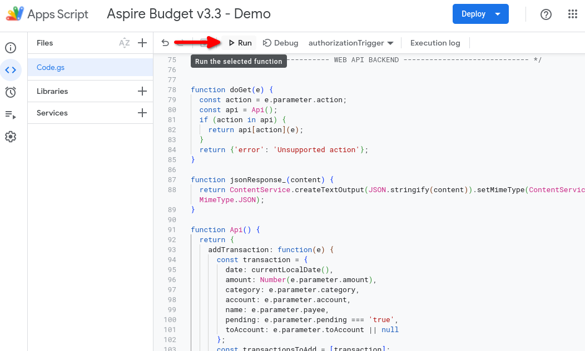
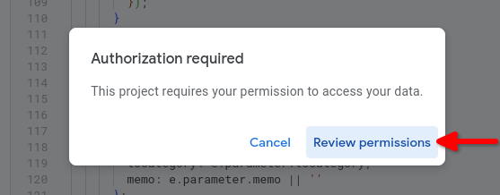

# iOS Shortcuts

iOS shortcuts to add transactions and category transfers from your iOS device into your AspireBudget spreadsheet


Shortcuts links:
1. Add transactions: https://www.icloud.com/shortcuts/e1a22f09e5c6444d885c32168bfb0bfe
2. Add category transfers: https://www.icloud.com/shortcuts/2d200b821e6249f89fbdbdc17982b49a

## Setup steps

To make this work you'll need to create an Apps Scripts project inside your spreadsheet. The setup should take less than 15 minutes

1. Go to your Aspire Budget spreadsheet and click `Extensions` -> `Apps Script`. This will open an unnamed Apps Script project, unless you already had a project attached to the spreadsheet:


2. Give a name to the project, it could be the same name as the spreadsheet


3. Replace the content of the `Code.gs` file with the content of the script [Code.gs](./Code.gs), and click Save
4. Create a new `Web app` deployment, execution as yourself, and giving access to `Anyone`:






5. Copy the resultant `Web app URL`, as it will be required for setting up the iOS shortcuts


6. From your iPhone or iPad, go to the [transactions shortcut](https://www.icloud.com/shortcuts/e1a22f09e5c6444d885c32168bfb0bfe), and tap `Set Up Shortcut`
7. For the first question, paste the `Web app URL` from the step 6
8. For the second question, paste the list of your categories, excluding your credit cards, as these shouldn't be used for transactions. One category per line, i.e
    ```
    Category 1
    Category 2
    ```
9. For the third question, paste the list of your accounts
10. From your iPhone or iPad, go to the [category transfers shortcut](https://www.icloud.com/shortcuts/2d200b821e6249f89fbdbdc17982b49a), and tap `Set Up Shortcut`
11. For the first question, paste the `Web app URL` from the step 6
12. For the second question, paste the list of your categories, including your credit cards, as these can be used for category transfers
13. Feel free to add these shortcuts as bookmarks in your home screen
