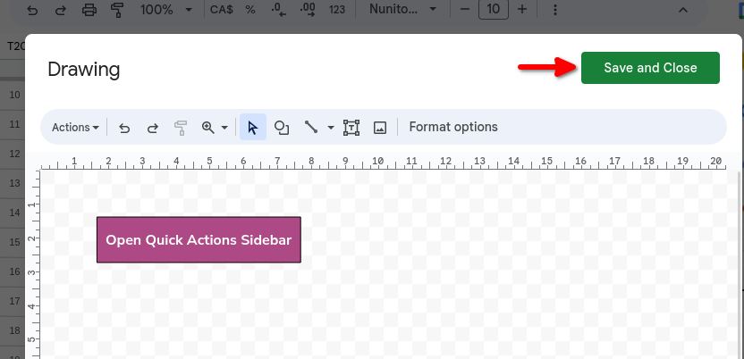

# Quick Actions Sidebar


## Why?

It's a handy way to enter transactions and category transfers into the budget without having to leave the Dashboard sheet

## How it looks


## Setup steps

The setup should take less than 15 minutes

1. Go to your Aspire Budget spreadsheet and click `Extensions` -> `Apps Script`. This will open an unnamed Apps Script project, unless you already had a project attached to the spreadsheet:


2. Give a name to the project, it could be the same name as the spreadsheet


3. Create a new `Script` file and name it `quick-actions-sidebar-backend`


4. Replace its content with the content of the script [quick-actions-sidebar-backend.gs](./quick-actions-sidebar-backend.gs), and click Save


5. Create a new `HTML` file and name it `quick-actions-sidebar`


6. Replace its content with the content of the script [quick-actions-sidebar.html](./quick-actions-sidebar.html), and click Save


7. Feel free to delete existing file `Code.gs`
8. Go back to the spreadsheet tab and refresh the page, you should see the option `Extensions` -> `Aspire Budget v3.3 - Demo` -> `Open Quick Actions Sidebar`, click it


9. The first time you run it Google will ask you for authorization. _Keep in mind that you are only authorizing the content of these scripts to be executed in your account and on your spreadsheet, you are not giving permissions to any external user/3rd-party-service._ Click `Continue`


10. Choose your account and go to the permissions screen


11. Read the permissions required and click `Allow` if you agree


12. Click again `Extensions` -> `Aspire Budget v3.3 - Demo` -> `Open Quick Actions Sidebar` and you should see the sidebar now


## Adding a button for quick access (optional but recommended)

To avoid additional clicks (`Extensions` -> `Aspire Budget v3.3 - Demo` -> `Open Quick Actions Sidebar`), you can add a button in the right side of the Dashboard sheet to open the Quick Actions Sidebar, it will look like this:


1. Go to the Dashboard sheet, click the cell R25 and click `Insert` -> `Drawing`
2. Draw the button, I used a rectangle shape with fill custom color `#ad4a86` and black border color. For the text I used `Nunito Sans` font, size 12, bold format and white color.
3. Once you are done click Save and Close



4. Position your button where you want and once you like the look of it and its position, click the three dots in the right top of the button, and click `Assign script`


5. Enter the text `onOpenQuickActionsSidebar` and click `OK`


## Technical notes

The organization of the scripts could be different, in my personal Apps Script project I split the scripts even more for better organization:
```
commons.gs
configuration.gs
category-transfers.gs
transactions.gs
quick-actions-sidebar-backend.gs
quick-actions-sidebar.html
quick-actions-sidebar-js.html
quick-actions-sidebar-css.html
```

I kept only 2 files in this repository to simplify the process for users who don't care about this